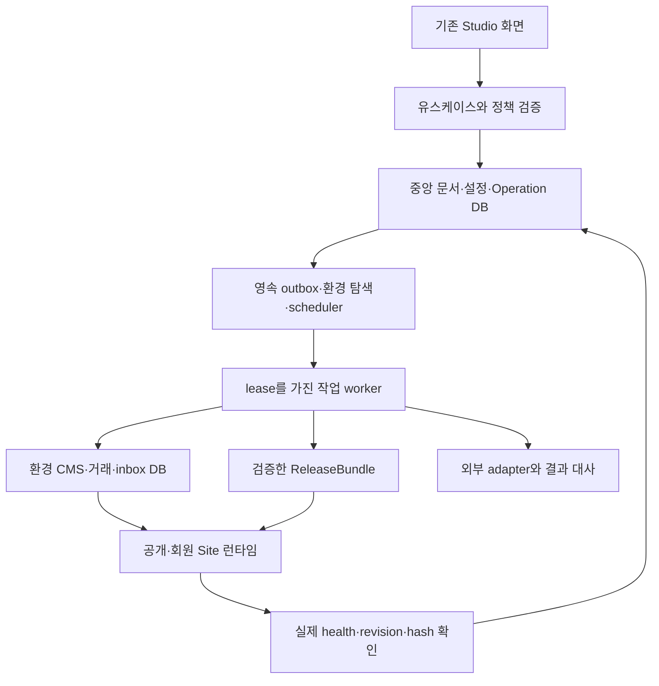

# 확장 버전 시스템 고도화 기획 H01~H48

작성일: 2026-10-07  
상태: 사용자 반영 승인. 고정 H01~H48의 기획 기준이며 구현·검증·외부 조건은 [시스템 구현 기록](system-implementation.md)과 [항목별 증거 목록](system-evidence-matrix.json)에서 확인한다. 기획 목표만으로 실환경 검증 완료를 뜻하지 않는다.

## 1. 기획 목적

기존 R01~R32 고도화와 E01~E32 확장으로 마련한 제작·콘텐츠·운영 플랫폼을, 데이터와 팀·사이트가 늘어도 변경과 장애를 설명하고 복구할 수 있는 시스템으로 발전시킨다.

제품의 기존 상단·8개 메뉴·캔버스·속성 패널을 유지한다. 조직 → 작업 공간 → 프로젝트 → 사이트 → 환경 구조, 제작자/방문자 인증 분리, 기존 ID·파일·DB·API 계약도 보존한다. 기능을 늘릴 때 사용자에게 필요한 설정과 현재 상태를 기존 업무 위치에서 제공한다.

다음 고도화의 핵심 결과는 다음과 같다.

1. 저장·승인·콘텐츠 전달·생성·실제 공개 사이의 상태를 명확히 구분한다.
2. 모든 비동기 작업을 재시작 후 발견하고 완료·중복·미확인 결과를 추적한다.
3. 큰 데이터에서 필요한 범위만 읽고 수정한다.
4. 변경 전에 영향을 확인하고 적용 뒤 실제 결과를 검증한다.
5. 운영 DB·파일·비밀키를 함께 복구할 수 있는 증거를 남긴다.
6. 측정한 병목과 운영 요구에 따라 인프라를 확장한다.

공급자·배포 대상·도메인은 미정이라는 기존 선택을 유지한다. 로컬에서 가능한 설계·구현·검증과 제공자 선정 후 가능한 실제 전달·거래·공개 배포·다중 호스트 검증을 별도 단계로 관리한다.

## 2. 현재 기준선과 다음 개선의 근거

기준 문서는 [확장 구현 기록](expansion-implementation.md), [현재 구조](architecture.md), [서버 계약](expansion-backend.md), [데이터베이스](database.md), [배포](deployment.md), [SDK](extension-sdk.md)이다.

| 영역 | 현재 확인한 기반 | 다음에 강화할 부분 |
|---|---|---|
| 편집 | 기존8메뉴, lazy 패널, 제작자별 IndexedDB, CAS·3영역 병합, 늦은 응답의 추가 편집 보존 | 전체 문서 저장 비용, 변경 단위 저장, 복구 가능한 오프라인 명령 |
| 범위/권한 | 중앙 creator와 visitor 분리, 조직/workspace/project/environment 서버 검증, 실행 시 권한 재검증 | 정책 계약·진단, 고위험 재인증, 기계 계정, 보안 변경 이력 |
| CMS | 타입·참조·승인·예약 발행, cursor API, 초기20개와 동적 상세·전체 sitemap | 현재 배열 전체를 필터/정렬하는 조회 비용, 레코드 단위 저장·인덱스·스키마 이전 |
| 자동화 | 영속 이벤트, 큐/lease/fencing, worker, 부분 실행 journal·outbox | 재시작 후 모든 환경 탐색, DB 사이 전달 보장, 시뮬레이션·실패 단계 대사 |
| 실행 | worker 분리·조직 공정성·한도, 수동 외부효과 unknown | 작업 종류별 자원 예산, 재시도 분산, 복구 작업용 용량, 종료/대기 해제 증거 |
| 결과물 | generator2.0, schema2, migration8, 소스 해시·독립 설치/재빌드/실행 | 전체 릴리스 계약, 공급망 증거, 검수한 동일 artifact의 운영 승격 |
| 복구 | 온라인 백업, 복원 전 백업, 파일 보존, 거래 대사·재실행 보류 | DB·blob·키 버전이 맞는 백업 집합, 자동 복원 훈련·측정 RPO/RTO |
| 규모 | Windows 단일 호스트·SQLite, 실제 프로세스 경쟁 검사 | 쿼리·WAL·event-loop·메모리 측정, 조건을 만족할 때 DB/저장소/큐 이전 |

현재 코드에서 우선 확인한 두 경계는 다음과 같다.

- `server/index.ts`의 이벤트 timer는 `operations.dataScopes.values()`를 순회한다. 이는 메모리에 열린 환경을 대상으로 하므로 재시작 뒤 아직 열지 않은 환경의 영속 이벤트를 발견하는 별도 절차가 필요하다.
- 중앙 문서 저장·환경 CMS snapshot 전달·생성 큐 등록은 서로 다른 DB/단계에 걸친다. 각 단계가 성공하더라도 다음 단계 전에 프로세스가 종료되는 경우를 영속 전달 기록과 재조정으로 다뤄야 한다.

`src/domain/cms.ts`의 조회는 현재 collection records 배열을 필터·정렬한 후 cursor를 적용한다. `server/expansion/organizations.ts`의 일부 목록은 전체 제한 조회 뒤 권한 필터를 수행한다. 현재 기능 검증과 별개로 데이터 규모 증가 시 쿼리 경계와 조회 단위 개선이 필요하다.

직전 구현 기록의 전체 단위/통합152개·브라우저30개 통과는 기존 기준선이다. 이번 기획 작성에서 프로그램 테스트를 다시 실행하지 않았다. 현재 명령 환경은 Node v22.22.3, 내장 SQLite3.51.3이다. 이 수치는 다른 OS의 Node나 과거 독립 결과물 런타임의 안전성을 자동 보장하지 않는다.

## 3. 우선순위와 범위 정의

- **P0:** 데이터 일관성·복구·보안·관측의 필수 기반. 공개 운영 및 큰 데이터 수용 전에 통과시킨다.
- **P1:** 팀 작업의 효율과 운영 품질을 높이는 후속 기능. P0 계약을 사용해 구현한다.
- **P2:** 실제 규모·제공자·사업 조건이 충족될 때 도입한다. 조건과 이전 절차를 먼저 마련한다.

P0는 모두 동일 시점에 완성하라는 뜻이 아니다. 개발 중에는 의존 관계 순서로 진행하고, 관리형 MFA·키 복구·공개 배포 항목은 해당 운영 모드를 열기 전에 검증한다. 아래 H01~H48은 새 고도화 요구사항의 고정 ID이며 기존 E 번호를 재사용하지 않는다.

항목의 의존은 연결할 계약과 안전장치를 뜻한다. 서로 연결된 기능은 공통 계약을 먼저 정의하고 legacy adapter로 시작해 작은 업무 흐름부터 구현한다. 관련된 모든 항목을 한꺼번에 완료해야 개발을 시작할 수 있다는 뜻은 아니다. 실행 단계 표의 인수 조건에서 최종 통합 여부를 확인한다.

## 4. 시스템 계약과 변경 관리

### H01. 런타임·빌드·기능 지원 상태를 검증한다 — P0

**목적:** 같은 버전 이름을 가진 실행물이 실제로 같은 코드·DB 엔진·기능을 사용하는지 판별한다.

**동작:** source/build hash, Node·SQLite 버전, artifact protocol, migration 범위와 capability를 실행 시 확인한다. OS별 포함 런타임을 해시와 지원 목록으로 관리한다. 생성기 버전이 같더라도 소스가 변경된 서버를 실행기가 재사용하는 경우를 감지한다. 현재 SQLite3.51.3을 취약하다고 판정하는 제안은 아니다.

**완료 기준:** 오래된 서버와 손상된 포함 Node를 준비 완료로 표시하지 않는다. 같은 코드의 정상 재사용은 유지한다. 미지원 문서를 읽어 원본을 훼손하지 않고 문제와 복구 경로를 안내한다.

**의존/위험:** H06·H30. 최소 Node 버전만으로 내장 SQLite 수정 여부를 판정하지 않는다. SQLite의 WAL 수정 이력과 실제 내장 버전을 대조한다. [SQLite WAL 공식 문서](https://www.sqlite.org/wal.html).

### H02. 유스케이스와 권한 정책을 함께 관리한다 — P1

**목적:** 신규 기능에서 HTTP 경로·UI·worker의 권한 규칙이 어긋나는 것을 줄인다.

**동작:** 조회/저장/승인/발행/복원 등 유스케이스별 입력·권한·대상·트랜잭션·오류 계약을 등록한다. 이미 있는 access와 서비스 계층을 사용하고 변경하는 경로부터 얇은 라우터와 명시적인 저장소 접근으로 정리한다. 사용자에게 허용되지 않은 작업의 상세 이유는 정보 노출을 제한해 제공한다.

**완료 기준:** 동일 작업의 UI·legacy/v1 API·worker에서 동일 권한 결과를 얻는다. 테스트가 새 경로의 정책 등록 누락을 탐지한다.

**의존/위험:** H03·H06. 범위 전체 리팩터링이나 실제 재사용 없는 공유 패키지 생성은 하지 않는다.

### H03. 모든 변경 작업에 공통 작업 문맥을 둔다 — P0

**목적:** 클릭, 저장, 큐, 외부 전달과 결과가 어느 요청에 속하는지 끝까지 추적한다.

**동작:** operationId·requestId·actor/realm·조직/환경·baseRevision·멱등성 키·입력 지문을 함께 기록한다. 현재 WorkItem 상태는 호환 유지하고 실행 상태, 외부 전달 상태, 공개 활성화 상태를 별도 필드로 관리한다. 저장 성공을 메일 전달 또는 실제 공개 성공과 혼동하지 않는다.

**완료 기준:** 중복 클릭·재접속은 같은 결과를 조회한다. 다른 내용으로 같은 키를 보내면 충돌한다. HTTP와 worker 결과를 하나의 이력에서 확인한다.

**의존/위험:** H11·H19·H42. 기록한 과거 policy version은 감사용이며 현재 권한 재검증을 대신하지 않는다.

### H04. 환경 설정도 버전과 변경 검토를 갖는다 — P0

**목적:** 디자인은 검토했는데 연결·도메인·정책이 바뀌어 다른 동작이 공개되는 문제를 줄인다.

**동작:** 환경별 configRevision과 검토된 ChangeSet을 만든다. 대상 환경, 승인 정책, 연결 참조, 일정, 복구 방법을 보여주고 예상 revision과 CAS로 적용한다. 비밀값은 표시하지 않고 참조·키 버전만 비교한다.

**완료 기준:** 검토 후 다른 사람이 설정을 바꾸면 재검토를 요구한다. 운영 연결을 검수 환경으로 묵시적으로 복제하지 않는다.

**의존/위험:** H03·H10·H15·H37. 설정 롤백과 외부 서비스에 이미 전달한 효과의 취소를 구분한다.

### H05. 기능 공개와 긴급 중지를 통제한다 — P1

**목적:** 새 기능을 일부 환경에서 검증하고 장애 시 영향 범위를 제한한다.

**동작:** 조직/환경별 기능 플래그, 기본값, 소유자, 만료 예정일, 변경 이력을 둔다. 신규 발행·비용 작업을 중지해도 기존 정상 사이트 읽기와 필수 대사는 유지한다. 같은 릴리스에서 flag revision을 기록한다.

**완료 기준:** 플래그가 꺼진 API도 서버에서 제한된다. 중지 후 이미 실행한 외부효과는 완료/unknown으로 정확히 남는다.

**의존/위험:** H02·H03·H19. 플래그를 영구 권한 정책으로 사용하거나 과거 기능을 몰래 삭제하지 않는다.

### H06. API·worker·artifact 호환 계약을 검사한다 — P0

**목적:** Studio·독립 서버·확장팩의 버전 차이로 저장이나 실행을 깨뜨리지 않는다.

**동작:** HTTP DTO, IPC envelope, 문서 schema, 패키지 protocol을 별도로 버전 관리한다. machine-readable 계약과 fixture로 기존 클라이언트·산출물 재읽기를 검사한다. sunset가 필요하면 영향 대상·대체 방법·지원 기간을 정한다.

**완료 기준:** 이전 프로젝트와 지원 대상 독립 결과물이 통과한다. 새 enum/필드의 도입이 기존 응답을 일방적으로 바꾸지 않는다. 미지원 버전은 변환 전 차단한다.

**의존/위험:** H01·H02·H30·H43. 소스 내부 타입과 공개 DTO를 무조건 동일 객체로 노출하지 않는다.

## 5. 데이터 저장·조회·이전

### H07. CMS와 편집 변경의 저장 단위를 줄인다 — P1

**목적:** 글 한 건을 수정할 때 전체 프로젝트를 읽고 저장하는 비용과 충돌을 줄인다.

**동작:** 컬렉션/레코드/언어/필드 revision을 보관하는 저장소를 도입한다. 작업본과 불변 발행본을 분리해 수정·검토 중에도 이전 발행본을 유지하고 승인된 새 revision의 공개 포인터만 교체한다. 발행 취소와 이전 발행본 복원은 별도 업무다. 기존 Project JSON은 읽기·독립 내보내기 계약으로 유지하고 canonical 레코드에서 snapshot을 만든다. 혼합 이전 기간의 authoritative source를 명시하고 두 곳을 동시에 원본으로 사용하지 않는다.

**완료 기준:** 한 레코드 수정이 다른 레코드의 revision을 불필요하게 바꾸지 않는다. 초안·예약본은 노출되지 않고 교체 전 공개본은 유지된다. legacy export/import 결과가 동등하다. 이전 중 재시작 후 동일 데이터가 나온다.

**의존/위험:** H06·H08·H09·H11·H33. 이전 전에 백업·건수·해시·참조 대사를 통과한다.

### H08. 목록·검색·cursor를 DB 경계에서 처리한다 — P0

**목적:** 응답은20개여도 서버가 전체 목록을 읽는 비용과 LIMIT 이후 권한 필터의 조회 누락을 해결한다.

**동작:** scope·공개 상태·권한·언어 조건을 SQL에 적용한 후 정렬/limit를 수행한다. 정렬키+안정 ID와 조회 revision에 연결된 cursor를 사용한다. 목록은 요약 DTO, 상세는 별도 조회로 분리한다. 검색 인덱스는 실제 질의에 필요한 것부터 추가한다.

**완료 기준:** 권한 있는 오래된 항목도 페이지를 통해 도달한다. 같은 정렬값·중간 수정·삭제에서 누락/중복 정책이 일관된다. 만료 cursor는 초기화 이유를 안내한다. 실행 계획·응답 크기·메모리를 측정한다.

**의존/위험:** H07·H43·H44. 권한 변경은 cursor와 캐시보다 먼저 검증한다. 정확한 전체 건수가 비싸면 total의 의미를 명시한다.

### H09. CMS 스키마 변경을 영속 이전 작업으로 만든다 — P1

**목적:** 필드 타입·필수값·참조 규칙 변경을 대량 데이터에서도 안전하게 수행한다.

**동작:** dry-run에서 영향을 받는 값·참조·실패 건수를 표시한다. source/target schema, 변환 규칙, checkpoint, 검증 실패 목록을 저장하고 배치 실행한다. 무효값은 격리해 수정하며 원래 값을 보존한다.

**완료 기준:** 중단·재개로 중복 변환하지 않는다. 잘못된 타입은 성공 처리하지 않는다. 새 모델 검증 실패 자료의 신규 발행은 차단하고 이전 모델의 마지막 검증된 발행본 유지 여부만 정책으로 결정한다.

**의존/위험:** H07·H10·H19·H40. 적용된 DB migration을 수정하지 않고 새 migration으로 호환 단계를 마련한다.

### H10. 사이트 전체 참조와 변경 영향을 조회한다 — P1

**목적:** 파일·필드·컴포넌트·팩·연결을 바꾸기 전에 사용처를 빠짐없이 확인한다.

**동작:** source/target/type/path/revision을 갖는 참조 그래프를 만든다. 영향을 받을 환경·블록·CMS·언어·workflow를 보여주고 삭제 대신 대체/보관/연결 해제를 선택한다. 언어별 slug와 기존 공개 주소 이력도 관리해 충돌·canonical·hreflang·사이트맵·리다이렉트를 함께 검토한다. 설치·업데이트 검토가 해당 그래프 revision에 묶인다.

**완료 기준:** 존재하는 참조의 대상 삭제를 차단하거나 명시적 대체를 요구한다. 오래된 영향 보고서로 적용할 수 없다. 현재 자료·override를 유지한다. 언어별 주소의 직접 열기·새로고침·SPA 이동과 이전 주소 연결이 같은 대표 주소를 사용한다.

**의존/위험:** H07·H09·H29·H37. 사용자가 읽을 수 없는 조직의 참조나 파일명은 결과에 노출하지 않는다.

### H11. DB 사이 전달을 영속 outbox/inbox와 재조정으로 보장한다 — P0

**목적:** 중앙 승인·환경 공개본·생성 큐 사이의 중간 실패를 복구한다.

**동작:** 원본 변경과 event 등록을 같은 로컬 DB 트랜잭션에 넣는다. 목적지 inbox가 eventId·payload hash·revision을 검증하고 멱등 적용한 뒤 ack를 남긴다. 승인/발행 Operation은 각 목적지 완료를 기록하고 누락을 재탐색한다. 서로 다른 DB를 하나의 원자 트랜잭션으로 가정하지 않는다.

**완료 기준:** 각 commit 직전/직후 종료를 주입해도 변경이 누락되지 않는다. 중복 이벤트는 효과를 반복하지 않는다. 역순 도착은 이전 revision으로 최신 공개본을 덮지 못한다. 외부 수신 성공이 불명확하면 대사 단계로 이동한다.

**의존/위험:** H03·H07·H19·H21·H24. 전달은 중복될 수 있고 consumer 멱등성이 필요하다는 원칙을 적용한다. [Transactional outbox 공식 안내](https://docs.aws.amazon.com/prescriptive-guidance/latest/cloud-design-patterns/transactional-outbox.html). rollback된 변경의 이벤트는 발송하지 않는다.

### H12. DB·저장소·큐의 전환 조건과 실제 이전을 설계한다 — P2

**목적:** 측정한 병목이나 다중 호스트 요구에 맞춰 운영 구조를 확장한다.

**동작:** lock wait, WAL 크기, 조회 비용, 데이터량, 복원시간을 먼저 측정한다. 서버 DB·객체 저장소·외부 큐의 adapter를 실제 두 구현에서 필요한 부분에만 만든다. tenant/env별 복사 → 검증 → shadow read → 쓰기 전환 → 대사 → 안정화 순서를 사용한다.

**완료 기준:** 전환된 조직의 이전 건수·참조·ledger·작업 상태가 일치한다. 이전 저장소는 전환 이후 새 쓰기를 반영하지 않았다는 점을 고려해 역이전 경로를 마련한다.

**의존/위험:** H07·H08·H11·H40·H44. WAL SQLite를 네트워크 공유 디스크에 두고 여러 호스트로 확장하지 않는다. WAL은 같은 호스트의 공유 메모리를 필요로 한다. [SQLite 공식 문서](https://www.sqlite.org/wal.html). 정확한 제품·크기·비용은 제공자 선정 뒤 결정한다.

## 6. 인증·권한·개인정보·비밀

### H13. 관리형 고위험 작업에 재인증과 MFA를 적용한다 — P0

**목적:** 탈취된 세션만으로 소유권·결제·키·복구 설정이 바뀌는 것을 줄인다.

**동작:** 관리형 owner/admin에 MFA 등록·복구 코드를 제공한다. 소유권 인계, master key 변경, 권한 상승, 데이터 복원과 결제 관련 설정은 최근 인증과 operation에 묶인 일회성 확인을 요구한다. TOTP 또는 검증된 WebAuthn 방식을 사용하고 선택/도입 시 라이브러리·실기기 검증을 수행한다.

**완료 기준:** API 직접 요청도 재인증 없이 고위험 실행이 불가능하다. MFA 교체·복구가 기존 인증보다 약한 우회 경로가 되지 않는다. 코드 재사용·만료·계정 잠금 복구를 검사한다.

**의존/위험:** H02·H03·H18. local-owner 사용성은 유지하되 managed로 승격될 때 등록 조건을 적용한다. 민감 작업의 재인증과 MFA 복구는 함께 설계한다. [OWASP MFA 안내](https://cheatsheetseries.owasp.org/cheatsheets/Multifactor_Authentication_Cheat_Sheet.html).

### H14. 사람의 API 키와 조직 기계 계정을 구분한다 — P1

**목적:** 담당자 퇴사와 장기 자동화의 수명주기를 명확히 관리한다.

**동작:** 현재 발급자 권한 연동 키는 유지한다. 별도의 조직 service identity는 명시적인 owner·capability·환경·만료·회전·폐기 정책을 갖는다. 최근 사용·마지막 실패·승인자를 보여주고 새/구 키를 제한된 전환 기간에 관리한다.

**완료 기준:** 개인 키는 사람 권한 회수와 함께 차단된다. 기계 계정은 조직이 승인한 범위에서만 동작하며 비활성화 즉시 신규 요청·작업 실행이 거절된다.

**의존/위험:** H02·H03·H13·H18. 기존 개인 키를 조용히 영구 조직 키로 바꾸지 않는다.

### H15. master key 회전과 키 분실 복구를 구현한다 — P0

**목적:** 비밀값 버전 변경과 암호화 master key 교체를 별개의 안전한 작업으로 다룬다.

**동작:** ciphertext에 keyId를 기록하고 새 쓰기는 새 키를 사용한다. 기존 비밀·웹훅 서명 비밀을 checkpoint로 재암호화하고 key별 참조 건수를 대사한다. 환경별 비밀 버전과 참조 해석을 명시해 검수 연결 변경이 운영에 전파되지 않게 한다. 등록 → 연결 시험 → 해당 환경 활성화 → 이전 버전 폐기 순서와 실행 작업이 사용한 참조 버전을 값 없이 기록한다. 이전 백업 복원에 필요한 키 버전의 보관 위치와 권한을 별도로 기록한다.

**완료 기준:** 회전 도중 재시작해도 복호화 가능하다. 검수 환경의 비밀 교체가 운영에 영향을 주지 않으며 시험 실패 시 이전 활성 버전으로 돌아갈 수 있다. 필요한 구 키가 없으면 복원·폐기를 차단한다. 원문과 master key는 브라우저·로그·프로젝트·일반 ZIP에 나오지 않는다.

**의존/위험:** H13·H18·H40. 같은 DB의 재암호화 완료가 모든 과거 백업에서 구 키를 제거해도 된다는 뜻은 아니다.

### H16. 파일 수집·변형·공개 범위를 단계로 관리한다 — P0

**목적:** 새 파일 종류·큰 이미지·공용 자산 확대 시 처리 상태와 노출 경계를 유지한다.

**동작:** 업로드 → 격리/검사 → 승인 → 변형 → 공개 가능한 자산의 상태를 둔다. 실제 MIME·서명·픽셀/압축 해제 한도·참조 권한을 검증한다. 필요한 크기의 이미지 변형을 만들고 private/public byte 경로와 캐시 키를 분리한다. 악성 검사 연결이 없으면 검사한 것으로 표시하지 않는다.

**완료 기준:** 검사 실패 또는 private 자산은 공개 CDN/HTML/독립 산출물로 넘어가지 않는다. 재시도해도 중복 변형·요금이 발생하지 않는다. 기존 이미지 참조는 호환된다.

**의존/위험:** H10·H19·H23·H30·H39. 제공자 미정인 CDN/백신 기능은 로컬 처리 계약과 실제 제공자 검증을 구분한다.

### H17. 데이터 분류·보존·삭제 요청을 운영한다 — P1

**목적:** 폼·회원·주문·자동화 payload가 무기한 흩어져 남지 않게 한다.

**동작:** 데이터 종류별 목적·보존 기간·읽기 권한·내보내기·삭제/비식별화 정책을 둔다. 활성 DB, workflow/outbox, 검색·캐시·blob·백업의 위치를 추적한다. 삭제 tombstone을 보관해 과거 백업 복원 뒤 삭제 대상이 다시 공개되지 않게 한다.

**완료 기준:** 한 사용자 요청의 적용 범위·보류 사유·처리 결과를 확인한다. 거래 보존이 필요한 데이터와 일반 콘텐츠를 구분한다. 키/비밀값을 개인정보 export에 포함하지 않는다.

**의존/위험:** H07·H10·H18·H40·H46. 기간과 법적 보존 의무는 실제 사업·관할 확인 뒤 정하며 법 준수 완료로 표현하지 않는다.

### H18. 지원 접근·감사 기록의 신뢰도를 높인다 — P0

**목적:** 누가 어떤 근거로 민감 작업을 했는지 복구 이후에도 확인한다.

**동작:** 기간/범위/사유가 있는 지원 세션, 사용 이력, 즉시 종료를 제공한다. actor·delegation·resource·operation·변경 전후 revision·결과를 append 형태로 남기고 tenant 권한으로 조회한다. 로컬 해시 연결과 외부 보관 가능한 주기 checkpoint를 구분한다.

**완료 기준:** 지원 권한 만료·회수 시 신규 요청과 다음 실행 단계가 차단된다. DB 복원 후 감사 순서·중복·누락을 설명한다. 로그에는 원문 개인정보·키가 없다.

**의존/위험:** H03·H13·H14·H15·H42. 같은 서버 관리자가 모든 파일을 수정할 수 있을 때 해시 체인만으로 변조 불가능을 주장하지 않는다.

## 7. 영속 작업·자동화·외부 연동

### H19. 단계별 작업 예산과 안전한 종료를 설계한다 — P0

**목적:** 작업이 멈춘 이유와 취소의 실제 효과를 명확히 한다.

**동작:** 대기·입력검사·생성·외부 전달·검증·활성화 단계별 deadline, heartbeat, 결과 근거를 둔다. drain 중 신규 수락을 제한하고 안전한 단계에서 종료한다. 이미 전달한 외부효과의 결과 미확인은 현재 unknown 원칙을 유지한다.

**완료 기준:** 늦은 worker가 종료 후 결과를 덮지 못한다. 검증된 완료를 취소로 위장하지 않는다. timeout 뒤 실행 중인 자식·lease·사용량 예약이 정해진 정책으로 회수된다.

**의존/위험:** H03·H11·H20·H24·H41. stage 완료와 사용자 전체 작업 완료를 구분한다.

### H20. 조직과 작업 종류별로 자원을 배분한다 — P1

**목적:** 대량 생성이 승인 발행·복구·예약 처리까지 막지 않게 한다.

**동작:** CPU 생성, 짧은 업무, 외부 I/O, 복구/대사 작업의 pool과 weight를 둔다. 기존 조직 공정성과 전역 한도를 유지하며 대기시간에 따른 aging·예약시각·제한된 우선순위를 적용한다. 복구 작업에 최소 실행 용량을 남긴다.

**완료 기준:** 한 조직의 작업 폭주가 다른 조직과 필수 복구를 무기한 지연시키지 않는다. 동시 coordinator가 같은 전역 정책 revision을 사용한다.

**의존/위험:** H19·H27·H44. 우선순위 상승을 사용자가 임의로 지정하지 못하게 하고 실제 CPU/RAM 측정을 반영한다.

### H21. 재시작 후 모든 환경의 예약·이벤트를 발견한다 — P0

**목적:** 메모리에 아직 열리지 않은 환경의 이벤트·전송을 재시작 뒤에도 발견한다. 이미 중앙 큐에 등록된 예약 발행은 현재도 영속 실행 흐름으로 재개되며 이 기반은 유지한다.

**동작:** 중앙의 영속 environment 목록과 작업 커서를 읽어 bounded 탐색한다. overdue 작업의 건너뛰기/한 번 실행/제한된 따라잡기 정책, timezone·다음 실행시각·소유 lease를 기록한다. 같은 이벤트는 중앙/환경의 목적지 inbox 기준으로 중복 제거한다.

**완료 기준:** 아무 프로젝트 화면을 열지 않고도 재시작 뒤 승인된 예약·영속 이벤트가 처리된다. 여러 scheduler가 중복 효과를 만들지 않는다. 대기 환경이 너무 많아도 한 번에 모두 DB 연결하지 않는다.

**의존/위험:** H11·H19·H20·H26·H41. 조직 보관·권한 회수·미승인 revision은 실행 전에 다시 확인한다.

### H22. 자동화를 실제 실행 전에 시뮬레이션한다 — P1

**목적:** 조건과 연결을 잘못 설정한 workflow의 영향을 적용 전에 확인한다.

**동작:** 익명화 fixture 또는 권한 있는 선택 이벤트로 조건/필드 mapping/예상 action을 dry-run한다. 실제 외부 전달·결제·발행은 하지 않는다. 실행 시에는 승인한 workflow revision을 고정하고 단계별 입력 지문·결과·재시도 가능 여부·보상 가능 행동을 기록한다.

**완료 기준:** 시뮬레이션이 외부효과를 발생시키지 않는다. 일부 성공 후 재실행이 이미 끝난 단계를 반복하지 않는다. 수정한 workflow가 과거 실행 내용을 바꾸지 않는다.

**의존/위험:** H10·H11·H19·H23·H24. 메일 전달이나 실제 결제처럼 되돌릴 수 없는 행동을 무조건 보상 가능이라고 표시하지 않는다.

### H23. 외부 adapter의 장애·속도·능력을 명시한다 — P1

**목적:** 제공자별 차이와 장애 시 결과를 일관되게 처리한다.

**동작:** 연결 contract에 읽기/쓰기·멱등성·서버 상태조회·취소·rate limit 능력을 등록한다. 총 deadline·bounded jitter retry·Retry-After·circuit breaker·동시 실행 제한을 사용한다. cache는 scope와 public/private를 포함하고 stale 상태를 표시한다.

**완료 기준:** DNS·TLS·느린 body·429·5xx·중복/역순 응답·타임아웃 뒤 외부 성공을 검사한다. provider가 없는 기능은 not-configured다. 재시도 가능한 행동만 자동 재전송한다.

**의존/위험:** H14·H15·H19·H24·H42. 기존 SSRF·host pinning·응답 크기 제한을 유지한다.

### H24. unknown과 복원 대사를 하나의 운영 업무로 만든다 — P0

**목적:** 결과 미확인 작업을 단순 재시도 버튼으로 처리하지 않게 한다.

**동작:** 내부 operation·provider command/transaction·금액/상태·예약/재고 차이·조회 근거를 비교한다. 담당자·조치·재조회·보류·승인을 기록한다. 실제 확인된 항목만 hold를 해제하고 이후 action이 그 결정 revision을 사용한다.

**완료 기준:** unknown을 확인 없이 성공·실패로 바꾸지 않는다. 수동 재실행도 새 중복 거래를 만들지 않는다. 결제 대사 완료와 전체 예약/재고 복구 완료를 분리한다.

**의존/위험:** H03·H11·H18·H23·H25·H40. 제공자가 상태조회/멱등성을 제공하지 않으면 사람이 거래 증거를 확인해야 한다.

## 8. 주문·예약·사용량·AI·확장 제품

### H25. 주문·결제·환불의 금액 원장을 분리한다 — P1

**목적:** 복원·부분 환불·역순 webhook에서 금액과 주문 표시가 일치하게 한다.

**동작:** 청구·결제 확인·취소·환불 요청·환불 확인을 원장의 별도 entry로 기록한다. 통화·정수 minor unit·명령 ID·provider event ID·시각·대사 revision을 연결한다. 수정 대신 정정 entry를 추가한다. 고객 주문과 플랫폼 구독은 별도 원장을 사용한다.

**완료 기준:** 중복/역순/부분 환불 뒤 확인 금액 합계가 주문 상태와 일치한다. 실제 공급자 확인 없이 paid/refunded로 바뀌지 않는다.

**의존/위험:** H11·H23·H24. 원장이 회계·세금·판매자 정산의 법적 요구를 자동 충족한다고 표현하지 않는다.

### H26. 현지 시간대의 예약과 정원 변경을 지원한다 — P1

**목적:** UTC 반복만으로 다루기 어려운 현지 영업시간·DST·휴일 변경을 설명한다.

**동작:** IANA timezone·현지 wall time·UTC 실행시각·시간대 해석 버전을 저장한다. 존재하지 않는 시각·두 번 나타나는 시각의 선택 정책을 제공한다. 자원 정원·휴일·일정 revision 변경은 확정 예약/hold/waitlist 영향 검토를 거친다.

**완료 기준:** DST 경계·휴일 추가·정원 축소·offer 만료·동시 hold에서 중복 예약이 없다. 기존 UTC 예약은 임의로 재해석하지 않는다.

**의존/위험:** H10·H21·H24. 시간대 규칙/라이브러리는 구현 시 최신 공식 자료와 실제 사례로 검증한다.

### H27. 사용량·추정비용·실제청구를 별도 원장으로 관리한다 — P0

**목적:** 한도 예약·실제 자원 사용·공급자 청구를 구분하고 재시작 후 누락을 복구한다.

**동작:** reservation/commit/release와 operation을 연결하고 만료 예약을 실행 결과와 대사한다. requests·tokens·CPU time·물리 bytes 등의 단위를 분리한다. 예상 공급자 비용과 수신한 청구 내역을 별도 표시한다. 복구·대사·권한 회수는 일반 서비스 비용 한도와 분리한 복구 예산·속도 제한·예약 용량을 사용한다. 물리 용량과 공급자 한도는 유지하고 한계가 있으면 담당자에게 안전한 보류 사유를 안내한다.

**완료 기준:** 중복 retry가 같은 사용량을 이중 정산하지 않는다. 실행된 실제 비용은 실패했더라도 사라지지 않는다. 조직/env별 집계가 원장 합계와 일치한다.

**의존/위험:** H03·H19·H20·H23·H25. 가격·세금·통화 환산은 실제 제공자 선택 후 검증하고 근거 없는 실제 금액을 만들지 않는다.

### H28. 콘텐츠·번역·AI 제안의 품질을 평가한다 — P1

**목적:** 생성 성공보다 안전하게 채택 가능한 결과를 늘린다.

**동작:** 작업별 입력 scope·허용 수정 필드·출력 schema·평가 rubric·회귀 corpus·비용/시간 예산을 둔다. 수동/AI 번역 모두 기준 원문 revision·담당·용어집·검토 상태를 기록한다. 원문에서 바뀐 필드의 번역만 재검토하고 번역 누락·실제 fallback 사용 위치를 보여준다. 근거 없는 수치 표시, 구조/링크/접근성 검사와 사용자 검토를 연결한다. 읽기 데이터·제안·채택·발행을 별도 단계로 기록한다.

**완료 기준:** 악의적인 콘텐츠나 지시가 권한 확대·비밀 읽기·결제/발행 실행을 유발하지 않는다. 동일 평가셋의 개선과 회귀를 비교하고 품질 미달은 자동 적용하지 않는다.

**의존/위험:** H02·H03·H10·H23·H27·H43. 외부 모델·데이터 보존·실제 비용은 제공자 설정 후 검증한다.

### H29. 블록·공용 컴포넌트·브랜드·팩의 배포를 관리한다 — P1

**목적:** 여러 사이트에 걸친 업데이트를 검토 가능한 릴리스로 운영한다.

**동작:** 블록 정의의 허용 속성·검증·내부 참조·공개 투영·편집 항목·접근성 조건을 공통 등록 계약에 연결한다. 기존16개는 블록별로 호환 이전한다. 의존 버전·호환 범위·지원 종료·변경 이유·작성자 승인을 포함한 릴리스를 만들고 누락·순환·충돌 의존성을 차단한다. H10 영향 그래프와 override/잠금 결과를 dry-run한다. 기준 공유본/현재 사용자 변경/새 공유본을 비교해 구조 추가·이동·삭제와 개별 예외를 검토한다. 선택 사이트에 순차 적용하고 문제 버전은 신규 설치/발행을 차단한다. 서명은 내용 해시와 작성자 신원 검증을 구분한다.

**완료 기준:** 새 승인 블록 하나가 같은 계약으로 편집·검사·SSR·독립 실행을 통과한다. 사용 중인 정의 삭제·권한 증가·renderer 변화는 별도 검토가 필요하다. 공유 트리 변경과 제거/복구 후 문구·블록 ID·내부 참조·override·운영 데이터를 보존한다.

**의존/위험:** H06·H10·H18·H37·H47. 임의 외부 JavaScript 실행은 현 선언형 catalog의 범위에 추가하지 않는다.

### H30. 독립 결과물의 공급망과 업데이트를 운영한다 — P1

**목적:** Studio가 없어도 출처·지원 범위·재빌드·복구 방법을 알 수 있게 한다.

**동작:** source/lock/runtime hash·dependency 목록·라이선스·빌드 환경·검증 증거·서명자·실행 capability를 포함한다. 외부 네트워크가 필요한 설치와 오프라인 실행을 분리한다. 업데이트는 새 결과 검증 후 교체하고 data/key는 별도 이전한다.

**완료 기준:** 포함된 Node와 서버 소스 변조를 탐지한다. 인터넷 없이 지원 대상 artifact가 실행된다. OS별 설치·재빌드·실제 폼/회원/주문/예약 동작을 별도 검사한다.

**의존/위험:** H01·H06·H15·H16·H29·H37·H43. 시간/경로 등 비결정 요소를 분리하고 바이트 동일 빌드를 실제 측정 전 주장하지 않는다.

## 9. 편집·협업·상태 이해

### H31. 역할별 시작 안내와 작업함을 제공한다 — P1

**목적:** 기능이 많아져도 사용자가 다음에 해야 할 일을 찾게 한다.

**동작:** 사이트 준비·승인 대기·연결 미설정·작업 실패·복구 보류를 역할별 업무로 보여준다. 권한 부족은 권한 요청, 연결 미설정은 설정 업무, 승인 대기는 담당자 인계, 실패는 복구 업무로 이어진다. 기존8메뉴로 이동하는 직접 링크와 필요한 입력을 제공한다. 중복 알림·읽음·담당·해결 상태를 관리하고 고급 설정은 관련 업무에서 펼친다.

**완료 기준:** 편집자는 편집/검토 요청, 검토자는 변경/영향 확인, 운영자는 실제 공개/대사 업무에 도달한다. 안내 클릭/읽음과 업무 완료를 구분해 실제 서버 상태로 완료를 판정하고 중단 지점부터 재개한다. 권한 없는 원문은 알림에도 노출되지 않는다.

**의존/위험:** H02·H03·H10·H24·H42. 준비된 코드와 실제 연결 검증의 완료 상태를 구분한다.

### H32. 원본·미리보기·실제 운영 환경의 상태를 분명히 한다 — P0

**목적:** 보고 있는 원본과 실제 공개 릴리스가 다른 상태를 설명한다.

**동작:** 선택 조직/site/env, 로컬/서버 저장 revision, 검토된 revision, 현재 preview/active release, dataKey 대신 이해 가능한 운영 데이터 범위를 표시한다. 페이지·선택 블록/필드·열린 메뉴·검색 조건을 계정별로 복원하고 검토 직접 링크·새로고침·뒤로가기에 같은 문맥을 사용한다. 생성 시작 시 고정된 환경 문맥을 유지하고 환경 이동 후 완료 결과는 해당 환경의 업무로 연결한다.

**완료 기준:** 선택 환경을 바꿔도 기존 작업의 대상이 바뀌지 않는다. 문맥 링크의 대상이 삭제되거나 권한이 회수되면 편집본을 보존하고 접근 가능한 위치를 안내한다. 운영 적용 전 무엇이 바뀌는지 확인한다. 오래된 미리보기에서 최신 운영 성공을 표시하지 않는다.

**의존/위험:** H03·H04·H31·H37·H39. 내부 키/경로를 일반 사용자의 핵심 흐름에 노출하지 않는다.

### H33. 오프라인 변경을 영속 명령으로 복구한다 — P0

**목적:** 재접속·탭 종료·저장 지연에서 작업을 잃지 않고 필요한 변경만 전달한다.

**동작:** 계정별 IndexedDB에 commandId·baseRevision·대상 경로·변경·적용 결과를 보관한다. 서버 ack 이후 정리하며, 중복 명령은 같은 결과를 반환한다. 미동기화 저널은 일반 백업 정리 대상에서 제외한다. 저장 공간 부족·세션 만료·탭 충돌·네트워크 단절을 구분하고 export/복구 경로를 제공한다. 문서 전체 PUT은 초기 가져오기/호환 경로로 유지한다. 저장 상태를 이 장치/서버 확인/검토 필요로 구분한다.

**완료 기준:** 로컬 저장 직후 종료, 서버 적용 뒤 응답 유실, 재연결 중 권한 회수에서 데이터가 조용히 사라지지 않는다. 다른 계정이 이전 계정의 queue를 읽거나 전송하지 않는다.

**의존/위험:** H03·H06·H07·H11·H34. 같은 명령을 원본에 두 번 적용하지 않는다. 삭제/권한/결제 작업을 오프라인 편집으로 임의 실행하지 않는다.

### H34. 협업 충돌을 필드와 작업 의미로 해결한다 — P1

**목적:** 큰 문서의 서로 다른 편집을 보존하고 겹치는 결정을 명확히 한다.

**동작:** 현재3영역 병합을 명령 의미 기반의 비교로 확장한다. 다른 필드의 독립 변경은 합치고 같은 필드·삭제/참조·schema·승인 영향은 검토한다. 충돌 항목 → 관련 필드 → 담당 인계/선택 → 재검토 흐름을 제공한다. 삭제/재배치된 의견의 대상 변경과 후속 위치를 추적한다. 실시간 이벤트는 resume cursor와 재조회 경로를 갖고 presence를 잠금으로 사용하지 않는다.

**완료 기준:** 기존 동시 변경 보존·revision 단조 증가·승인 회수를 유지한다. 새 명령 의미 기반 삭제/참조 충돌, 이벤트 누락 후 재접속, 대상 변경 후 의견 인계를 검사한다.

**의존/위험:** H07·H10·H33·H43. 실제 동시 텍스트 편집 수요가 확인되면 제한된 필드의 CRDT를 검토하며 전체 Project에 즉시 적용하지 않는다.

### H35. 큰 캔버스와 목록의 편집 성능을 관리한다 — P1

**목적:** 블록·레코드·사이트가 늘어도 입력과 선택이 빠르게 반응하게 한다.

**동작:** 실제 프로젝트 크기별 profiling 후 요약 목록, 적절한 가상 목록, 숨김/접힘 영역 렌더링, 선택 영역 검사, 변화 기반 품질 검사를 적용한다. 이미지·폰트·코드 chunk는 필요한 시점에 가져온다. 검사 비용은 worker 이동의 효과를 측정한다.

**완료 기준:** 지원하는 크기의 입력 지연·전환 시간·메모리를 목표와 비교한다. 화면 밖 블록의 순서·키보드 이동·검색·내보내기가 유지된다.

**의존/위험:** H07·H08·H33·H36·H44. 가상화 때문에 스크린리더와 브라우저 검색이 깨지지 않도록 대체 목록을 제공한다.

### H36. 접근성과 오류 복구를 실제 업무로 검증한다 — P1

**목적:** 키보드·작은 화면·보조 기술 사용자가 승인/충돌/복구까지 수행하게 한다.

**동작:** 기존 focus 복귀·dialog trap·status live region·색 이외 표시·구체 오류 링크·키보드 편집을 유지한다. 레이어의 구조/선택/위치, 충돌 비교 값, 대상 삭제 후 포커스, 권한 제한 이유를 보조 기술에 설명한다. 페이지 선택 → 블록 편집 → 충돌 검토 → 승인 → 발행/대사 결과 확인을 고정 핵심 업무로 정해 스크린리더와 실제 기기에서 점검한다. 실패 입력은 보존하고 재시도 범위와 결과 미확인을 설명한다.

**완료 기준:** 포인터 없이 핵심 흐름을 끝낸다. 동일 오류가 반복 알림으로 쌓이지 않는다. 수동 검사 결과와 미검증 장치를 기록한다.

**의존/위험:** H31·H32·H34·H35·H43. 자동 접근성 검사 통과를 실제 보조 기술 검사 완료로 표현하지 않는다.

## 10. 릴리스·공개 운영·복구·관측

### H37. 검수한 릴리스 묶음을 그대로 승격한다 — P0

**목적:** 검수와 운영에서 서로 다른 원본/팩/설정으로 재생성되는 차이를 줄인다.

**동작:** projectRevision·CMS publication revision·schema·pack pins·public assets·runtime/build hash·config contract·approval fingerprint를 ReleaseBundle로 묶는다. 캠페인 단위 페이지·CMS·참조 자료·언어 버전을 함께 검토하고 누락 번역/fallback·미승인 참조·예약시각 변경을 표시한다. 코드/디자인·승인에 고정한 콘텐츠와 계속 갱신을 허용하는 서버 CMS/외부 binding의 범위를 구분한다. 한 번 빌드/검증한 환경 독립 내용 artifact와 환경별 activation manifest·비밀 참조·운영 DB binding을 분리해 각각 hash와 권한을 검증한다. 현재 dataKey 귀속 검사를 단순 완화하지 않고 승인한 명시적 승격 경로를 추가한다.

빌드에 고정된 siteUrl/canonical·OG·sitemap·공개 JSON과 환경별 preview 접근/robots 정책을 구분한다. node 결과는 환경 binding으로 처리 가능한 부분을 명시하고, static export에서 환경별 HTML이 달라지면 같은 코드/디자인 release의 별도 hash를 가진 variant로 기록한다. 그 경우 전체 artifact가 동일하다고 표시하지 않는다. 내용 변경과 디자인 변경의 경로를 구분한다.

**완료 기준:** 승격 계약에 고정한 내용 artifact hash와 운영 활성 내용 artifact hash가 일치한다. 환경 manifest·URL/SEO와 동적 데이터의 차이도 따로 확인한다. 승인 범위의 drift는 재검토하고 허용한 동적 데이터 갱신은 명시된 정책으로 처리한다. 롤백은 최신 고객 DB를 유지한다.

**의존/위험:** H04·H06·H10·H11·H29·H30·H32. 비밀값과 방문자 데이터를 릴리스에 복제하지 않는다.

### H38. CI/CD를 품질·승인·실제 공개 증거와 연결한다 — P1

**목적:** 빌드 완료와 실제 배포 성공을 분리해 반복 가능한 배포를 운영한다.

**동작:** Windows/Linux 검사, 계약/이전 fixture, artifact 생성/서명, 검수 배포, smoke, 승인, 운영 승격, 실제 revision/hash health 확인을 단계화한다. 제공자 설정 전에는 검증/패키징 workflow까지만 실행하고 provider별 배포 adapter를 검증한다.

**완료 기준:** failing 검사와 approval mismatch는 운영 배포를 막는다. push 이후 실제 공개 SHA가 맞는지 검사한다. 실패 시 이전 artifact로 복구하고 배포 이력을 남긴다.

**의존/위험:** H01·H06·H30·H37·H41·H43. CI workflow 작성이나 로컬 Dockerfile 빌드를 실배포 증거로 사용하지 않는다.

### H39. 원격 미리보기·도메인·TLS·공개 캐시를 운영한다 — P2

**목적:** 팀의 원격 검수와 실제 고객 공개를 안전하게 제공한다.

**동작:** 환경별 preview origin·접근 인증·만료시각·robots 정책·폐기 상태를 둔다. 실제 도메인/TLS 발급/갱신 상태를 확인한다. 공개 cache는 release/content revision·언어를 키로 사용하고 member/private 응답을 분리한다.

**완료 기준:** 만료 미리보기 접근을 거절하고 noindex/no-store와 관리하는 origin/CDN의 purge 결과를 확인한다. 이미 수집된 제3자 검색·캐시 결과는 별도 제거 요청/확인 대상으로 표시한다. 로컬 주소를 원격 공유 주소로 안내하지 않는다. 도메인 오류·갱신 실패·내용 발행 후 cache 무효화를 실제 환경에서 검사한다.

**의존/위험:** H04·H13·H16·H37·H38. 배포 제공자·도메인·DNS 권한 선정 후 시행한다.

### H40. DB·파일·키의 백업 집합과 복원 훈련을 마련한다 — P0

**목적:** DB만 복원했는데 이미지나 암호화 연결을 잃는 문제를 줄인다.

**동작:** 중앙 DB, 환경별 DB, immutable blob 목록/hash, artifact, keyId와 별도 보관 키의 연결을 BackupSet으로 기록한다. 일관 시점 watermark 또는 짧은 scoped freeze·검증 과정을 둔다. 복원 시 과거 세션을 무효화하고 백업 이후 계정 폐기·권한 회수·API/기계 키 폐기·삭제 tombstone을 최신 회수 기록에서 재적용한다. 최신 회수 상태를 확인할 수 없으면 관련 인증/기계 접근을 보류한다. 격리된 대상으로 정기 복원하고 실제 재로그인·공개 조회·거래 대사·이벤트 재탐색을 수행한다.

**완료 기준:** 건수·참조·파일 hash·복호화·거래/예약 대사와 삭제/권한 회수 기록 재적용을 통과한다. 폐기된 계정/키가 복원 후 다시 동작하지 않는다. 실제 RPO/RTO를 측정한다. 새 장비에서도 복구 방법을 실행할 수 있다.

**의존/위험:** H11·H15·H17·H21·H24·H30·H45. master key를 DB와 같은 평문 ZIP에 넣지 않는다. 지원하지 않는 무중단 일관 백업을 주장하지 않는다.

### H41. 준비 상태·종료·자가 복구를 구분한다 — P0

**목적:** HTTP가 응답하는 것과 일을 맡을 수 있는 상태를 구분한다.

**동작:** liveness, readiness, dependency degraded, draining을 나눈다. readiness는 DB/migration·필수키·worker·디스크·job 정책을 검사한다. worker 종료·event-loop 지연·clock 차이를 관측하고 bounded restart/backoff를 사용한다.

**완료 기준:** 준비되지 않은 프로세스가 새 발행/비용 작업을 수락하지 않는다. graceful/강제 종료 모두에서 현재 작업·lease·unknown 처리가 일관된다. 재시작 폭주를 막는다.

**의존/위험:** H01·H19·H20·H21·H42. 공개 health에는 민감한 경로·키·조직 정보 없이 요약만 제공한다.

### H42. 사용자 작업을 trace·지표·알림으로 연결한다 — P0

**목적:** 느린 이유와 실패한 단계를 operation 단위로 설명한다.

**동작:** HTTP → queue → IPC worker → DB/event → 외부 요청 → 공개 검증에 trace context를 전달한다. latency·error·queue age·lease loss·event lag·unknown·backup age·provider failure를 수집한다. alert는 중복/해제·담당·runbook 링크와 영향을 갖는다.

**완료 기준:** 하나의 operation으로 원인 단계와 최종 사용자 상태를 찾는다. 권한 없는 tenant 지표나 원문은 보이지 않는다. metrics label에 무제한 user/operation ID를 넣지 않는다.

**의존/위험:** H03·H18·H19·H23·H40·H41. 요청 경로를 span과 context propagation으로 연결하는 구조를 따른다. [OpenTelemetry traces](https://opentelemetry.io/docs/concepts/signals/traces/). 제공자 없는 로컬 수집/파일 증거와 실제 운영 collector를 구분한다.

## 11. 검증·수명주기·사업 확장

### H43. 요구사항별 검증 증거를 릴리스에 연결한다 — P0

**목적:** 테스트 개수만으로 완료를 판단하지 않고 실제 위험과 계약을 검증한다.

**동작:** H/E/R 요구사항 → 외부 동작 → 테스트/수동 검사 → 실행 환경 → commit/build hash → 결과를 연결한다. legacy 문서, 이전 schema, pack compatibility, role/env matrix, 독립 node/static, 공개/회원/초안 projection을 검사한다. property/state-machine 테스트는 실제 상태 전이 위험에 사용한다.

**완료 기준:** 핵심 경계가 검증되지 않으면 해당 기능은 미검증으로 남는다. 기존 fixture·테스트를 제거해 통과시키지 않는다. 독립 결과물이 Studio 없이 재빌드된다.

**의존/위험:** H01·H06·H30·H36·H38·H44·H45. 모든 OS·장치·제공자 통과를 하나의 로컬 테스트로 주장하지 않는다.

### H44. 용량·부하·장기 실행 목표를 측정한다 — P0

**목적:** 지원 가능한 프로젝트·팀·CMS·작업 규모를 수치로 결정한다.

**동작:** 작은/중간/지원 상한 프로젝트, 여러 조직의 읽기/쓰기/생성/검색 혼합 부하를 재현한다. CPU/RAM, event-loop, DB lock/WAL, query plan, queue age, GC, 파일 증가를 측정한다. 1시간 smoke 후 목표에 맞는 장기 soak를 단계적으로 실행한다.

**완료 기준:** 지원 규모·기계 사양·원본 크기·동시성·p95/p99·실패율을 보고한다. 한도를 넘기면 명시적으로 거절하거나 대기하고 데이터 손상을 만들지 않는다.

**의존/위험:** H07·H08·H19·H20·H35·H42·H43. 아래 수치는 목표 제안이며 현재 성능을 측정했다고 해석하지 않는다.

### H45. 장애 복구를 실제로 훈련한다 — P0

**목적:** 잘 작성된 복구 문서를 실제 실행 가능한 절차로 만든다.

**동작:** 격리 fixture에서 worker 강제 종료, 응답 유실, lease 만료, 디스크 부족, 오래된 승인, 권한 회수, 제공자 중단, DB/키 불일치, 잘못된 artifact를 주입한다. 각 단계의 expected state와 복구 담당·조치·완료 근거를 기록한다.

**완료 기준:** 확인된 거래의 유실·중복 외부효과·다른 조직 노출을 방지하고 미확인은 안전하게 보류한다. 일반 편집 자료는 합의한 RPO 범위와 실제 유실 구간을 보고하며 회수 가능한 거래·미확정 항목을 대사한다. 복구 시간을 측정하고 누락된 조건을 회귀 검사로 남긴다.

**의존/위험:** H11·H15·H19·H24·H40·H41·H43. 실제 고객 DB나 운영 외부 결제에 파괴적 장애를 주입하지 않는다.

### H46. 조직 인계·보관·폐기를 단계화한다 — P1

**목적:** 계정 탈퇴와 조직/사이트 운영 종료를 구분해 고객 데이터와 거래를 보존한다.

**동작:** 소유권 인계 제안/수락/재인증, 조직 보관, 새 작업 중지, 실행 작업 정리, 연결/키 폐기, 자료 export, 법적 보존/삭제 판단을 순서화한다. 관련 운영 DB·preview·팩·지원 세션의 상태를 확인한다.

**완료 기준:** 마지막 owner를 잃지 않는다. 보관된 조직이 신규 비용 작업을 실행하지 않는다. 이미 진행한 외부 거래와 미확인 작업은 대사로 이어진다.

**의존/위험:** H13·H14·H17·H18·H19·H24·H40. 인계가 다른 조직의 비밀값/방문자 자료를 자동 복제하는 기능이 되지 않는다.

### H47. 확장 유통의 승인·지원·책임을 정한다 — P2

**목적:** 공유할 수 있는 팩을 운영 가능한 catalog로 발전시킨다.

**동작:** publisher 확인, 검토 기준, 호환 증거, 라이선스, 지원/취약점 연락, 문제 버전 회수·사용자 안내·업데이트 경로를 제공한다. 첫 단계는 관리자 승인 catalog다. 판매자 결제·정산·공개 marketplace는 사업·세무·제공자·격리 조건을 별도로 충족할 때 연다.

**완료 기준:** 문제 버전을 사용하는 사이트를 찾아 안내하고 신규 설치를 차단한다. 제거 시 현재 자료를 보존한다. 서명 여부·작성자·지원 범위를 사용자가 확인한다.

**의존/위험:** H06·H18·H29·H30·H43. 임의 코드를 실행하는 marketplace는 선언형 SDK와 별도 보안 제품 범위다.

### H48. 실제 제품 성과와 실험 중단 조건을 정한다 — P2

**목적:** 추가한 기능이 사용자 업무를 실제로 개선하는지 판단한다.

**동작:** 첫 저장/검토/공개 도달 시간, 정상 발행율, conflict 해결 시간, 자동화 미확인 비율, 반복 사용, 복구시간을 정의한다. 익명/최소 집계와 보존 설정을 두고 실험별 가설·대상·기간·보호 지표·중단 기준을 기록한다. 계정/작업 공간/방문자 중 할당 단위를 정하고 안정적인 그룹을 유지한다. 분모·중복 제거·판정 기간·표본 부족의 판단 보류를 명시한다.

**완료 기준:** 로컬 fixture와 실제 사용자/거래를 분리한다. 기능 플래그 전환의 효과와 오류/비용 증가를 함께 평가한다. 성과가 나쁘면 실험 플래그를 이전 상태로 되돌리되 작성 문서·진행 업무를 되돌리지 않는다.

**의존/위험:** H05·H17·H27·H31·H42·H44. 실제 청구·법적 동의·외부 사용자 연구는 선정한 운영 환경과 사업 조건에서 검증한다.

## 12. 목표 구조와 책임

기존 디렉터리를 유지하며 제어·제작·사이트 실행 책임을 구분한다. 초기에는 서비스를 기존 프로세스와 모듈 안에서 정리하고, 생성/자동화/serving의 현 worker 분리를 유지한다. 독립 배포가 실제 필요한 모듈만 추후 분리한다.

| 계층 | 책임과 주요 영향 영역 |
|---|---|
| Presentation | 기존 editor 패널, 작업함·비교·준비상태; `src/editor/`, HTTP 라우팅 |
| Application | Operation/ChangeSet, 승인·전달 saga, 유스케이스·권한·트랜잭션; `server/expansion/`, operations/deployment |
| Domain | 참조·버전·변경·상태전이·시간대·금액 규칙; `src/domain/` |
| Infrastructure | SQL 저장소/인덱스, inbox/outbox, scheduler, vault keyring, blob, IPC, CI/수집기 |

공유 패키지는 두 앱 이상이 실제로 사용하는 계약이 있을 때만 만든다. domain은 HTTP/React/DB에 의존하지 않고 provider adapter는 timeout·scope·오류·멱등성 계약을 갖는다.

## 13. 추가 데이터와 API 계약의 개념 설계

아래 이름은 구현 때 기존 엔터티와 합칠 수 있는 개념이며 테이블을 무조건 각각 생성하라는 요구가 아니다. 적용된 migration1~8은 유지하고 이후 번호의 additive migration으로 설계한다.

| 개념 | 주요 필드·불변 조건 |
|---|---|
| Operation | scope/actor, commandId·fingerprint, 실행/전달/활성화 상태, trace, revision, 결과 근거 |
| ChangeSet/ConfigRevision | 대상·기준 revision·영향·승인자·만료·config hash; 비밀 원문 제외 |
| CmsRecord/Revision | collection/record/language/schema version, typed values, contentRevision, 공개 revision |
| ReferenceEdge | 읽을 수 있는 source/target/type/path와 기준 revision |
| DeliveryEvent/Inbox | eventId·source/target·payload hash·sequence·상태·ack; DB 내 unique |
| SchedulerCursor | 환경·업무·nextAt·timezone·catch-up policy·checkpoint·lease |
| Ledger/UsageEntry | integer amount/unit, currency, source operation, provider evidence, 정정 연결 |
| KeyVersion | keyId·상태·참조·회전 checkpoint; master key 원문은 별도 비밀 보관 |
| ReleaseBundle | 검수한 source/content/schema/pins/runtime/config contract·승인 지문·hash |
| BackupSet | DB watermark·파일 hash 목록·keyId·검증·복원 훈련 결과 |
| Evidence/Incident | 요구사항·실행 환경·artifact·검사 결과·담당·조치·완료 근거 |

신규 공개 API는 기존 v1을 깨지 않고 capability/버전을 명시해 추가한다. 목록은 cursor/limit/filter/sort를 검증하고 에러는 code·사용자 메시지·requestId를 제공한다. 후보 리소스는 operations, change-sets, configuration-revisions, publication-events, delivery-events, reconciliations, backup-sets, readiness-reports다. 새 URL과 DTO는 실제 구현 전 OpenAPI·호환 테스트로 확정한다.

## 14. 핵심 업무의 성공·실패 흐름

### 승인한 CMS를 공개하는 흐름

1. 제작자가 변경 명령과 baseRevision을 제출한다.
2. 서버가 현재 actor/scope/입력/참조를 검증하고 작업본과 변경 event를 같은 DB transaction으로 기록한다. 승인 전 변경 event는 발행 command가 아니다.
3. 검토자는 변경 내용·영향·대상 revision을 승인한다. 승인 뒤 수정되면 무효화한다. 게시 요청 시 현재 게시 권한·승인 revision/지문·발행 sequence를 검증하고 별도 발행 command/outbox를 영속 등록한다.
4. 즉시 발행 dispatcher 또는 예정 시각의 scheduler가 목적지 inbox에 승인된 revision을 전달한다.
5. 필요한 생성/콘텐츠 snapshot 준비·검증을 수행한다. 활성화 직전에 현재 승인·권한 회수·발행 sequence와 lease를 다시 확인하고 공개 포인터를 CAS로 전환한다.
6. 실제 공개 revision·hash를 확인한다. Operation은 서버 저장, 승인, 공개본 전달, 실제 활성화의 결과를 각각 보여준다.

중간 실패는 해당 event/revision부터 재개한다. 기존 정상 공개본은 새 공개본 검증 전 유지한다. 부분 공개가 가능한 기능은 그 범위와 재조정 상태를 명시한다.

### 외부 효과가 미확인인 흐름

1. Operation과 멱등성 키를 영속 저장하고 worker가 실제 요청을 보낸다.
2. 응답이 유실되면 provider 능력에 따라 상태조회한다.
3. 확인할 수 없으면 unknown과 해당 주문/예약 hold를 남긴다.
4. 담당자가 외부 거래 근거를 확인하거나 provider adapter로 대사한다.
5. 확인된 결과와 대사 revision을 기록하고 허용하는 후속 업무만 재개한다.

취소 버튼을 눌렀다는 사실만으로 외부 효과가 취소되었다고 표시하지 않는다.

### 백업 복원·제품 롤백 흐름

디자인 롤백은 이전 artifact와 최신 고객 DB를 연결한다. 데이터 복원은 선택 시점의 DB로 이동하므로 before-restore backup, 키/파일/거래 확인, 작업 drain, candidate 검증, 활성화, 이벤트 재탐색과 대사를 별도로 거친다. 새 스키마에 옛 앱을 바로 기동하지 않고 지원되는 백업/역이전 경로를 사용한다.

## 15. 단계별 실행 순서와 인수 조건

| 단계 | 핵심 범위 | 인수 조건 |
|---|---|---|
| 1. 일관성·재시작·추적 | H01/H03/H06/H11/H19/H21/H32/H41/H42, H02 최소 정책 연결 | 화면을 열지 않은 재시작 복구, 단계별 종료와 중복 전달 통과, 과거 API/문서 호환 |
| 2. 큰 데이터·변경 관리 | H04/H07~H10/H27/H33~H36, H43/H44 기준선 | 레코드 단위 CAS·범위 SQL·이전 dry-run·오프라인 재생·성능/접근성 증거 |
| 3. 보안·업무·복구 | H13~H18/H20/H22~H26/H28/H31/H40/H45/H46 | 고위험 재인증·키 회전/복구·unknown 대사·복원 훈련·업무 상태 일치 |
| 4. 검수와 공개 운영 | H05/H29/H30/H37/H38, H39 제공자 설정 후 | 검수와 운영 artifact 동일·승인 CAS·실제 공개 health/hash·수신/거래 확인 |
| 5. 측정 기반 확장 | H12/H47/H48 및 실제 운영 수치 재평가 | 필요성과 비용 확인, 이전 rehearsal·역이전·공개 catalog/실험 보호 기준 |

단계는 출시 gate이며 절대 일정이 아니다. 담당 인원·제공자·데이터량이 정해지기 전 달력 기간과 예산을 확정하지 않는다. 공통 계약 → DB 이전과 작업 복구 → 업무 UI → 독립 결과물 → 전체 검증 → 실제 운영 순서로 기능별 작은 변경을 진행한다.

## 16. 목표 수치와 측정 계획

다음은 **기획 목표 제안**이며 현재 달성 성능이나 보장 SLA가 아니다. 첫 부하 측정에서 기계 사양·DB 크기·동시 요청·네트워크·제공자 비용을 기록하고 조정한다.

| 항목 | 초기 제안 | 측정/조정 방법 |
|---|---|---|
| 편집 입력 반응 | 지원 크기에서 p95 100ms 이하 | 입력 event부터 다음 화면 표시까지, 선택·undo와 long task |
| 핵심 목록/단건 조회 | 지정 부하에서 p95 500ms 이하 | provider 호출 제외/포함을 분리, query plan·body bytes |
| 일반 저장 확인 | 지정 부하에서 p95 1초 이하 | 마지막 편집부터 debounce 포함 서버 ack까지; 장치 저장/HTTP 처리/외부 전달 별도 측정 |
| 가벼운 업무 큐 대기 | 정상 혼합 부하 p95 5초 이하 | 작업 종류/조직별 queue age; 큰 생성은 별도 목표 |
| 내부 예약 정확도 | 정상 상태에서 예정 시각 대비 p95 10초 이내 | overdue/catch-up와 외부 제공자 지연을 구분 |
| 복구 목표 | 초기 managed 후보 RPO 15분·RTO 60분 | 주문/결제는 외부 원장 대사 포함; 백업 주기·비용으로 재설정 |
| 공개 서비스 가용성 | 공개 읽기 pilot 후보 월99.5% | 실제 외부 probing·계획중단·실패 정의 확정; 제작/발행은 별도 지표 |
| 규모 fixture | CMS 1천/1만건, 블록 100/500/1천, 조직 혼합 부하 | 현재 도메인 한도를 확인하고 이 범위 지원 변경/측정을 별도 수행 |

성공한 요청의 지연만 집계하지 않고 timeout·실패율·중단 작업을 함께 보고한다. RPO15분이 확인된 결제 거래를 잃어도 된다는 의미는 아니다. 거래 원장과 외부 provider에서 회수 가능한 event를 대사해야 한다. 목표를 만족하지 못하면 지원 상한을 낮추거나 해당 개선/인프라 이전을 먼저 수행한다. 용량이 실제 측정되기 전 무제한 규모를 안내하지 않는다.

## 17. 위험·배포·롤백 원칙

- 현재 사용자 원본·운영 DB·적용 migration·lockfile·기존 테스트를 보존한다.
- additive schema → 호환 읽기/쓰기를 지원하는 코드 → 배치 이전 → 대사 → 전환 순서로 진행한다. deprecated 삭제는 별도 후속 릴리스다.
- 두 앱 버전이 혼재할 때 지원하는 schema/protocol 범위를 배포 전에 확인한다. 호환하지 않으면 무중단 배포를 주장하지 않는다.
- migration 적용 전 온라인 백업, blob 목록과 필요한 keyId, 실행 중 작업 정리 계획을 확보한다.
- artifact rollback과 DB 복원·외부효과 취소는 다른 업무다. 코드만 되돌려 새 데이터가 사라지지 않게 한다.
- 사이트 DB와 중앙 DB가 서로 다른 transaction인 경계를 없애려면 실제 저장소 설계가 필요하다. 현재 구조에서는 saga/outbox/inbox로 누락을 재조정한다.
- 제공자/OS/Docker/다중 호스트·지역 시간대·실기기 검증은 해당 환경 증거가 있어야 완료다.
- 데이터 삭제·영구 키 폐기·운영 destructive migration은 영향과 복구 가능성을 확인하고 명시적인 사용자 승인 범위 안에서 수행한다.
- 새로운 의존성은 기존 구현/표준 기능으로 해결 가능한지, 유지보수·취약점·라이선스·번들·환경 호환을 확인한 뒤 채택한다.

## 18. 고도화 구현의 완료 조건

각 H 항목은 계약·도메인 규칙·저장/이전·실제 API·업무 UI·운영 문서·검증 증거가 필요한 범위에서 연결되어야 완료다.

1. lint·typecheck·관련 unit/integration·production build가 통과한다.
2. 핵심 브라우저 흐름, 기존 원본/산출물 호환, scope/role/env 공격과 회귀 검사를 통과한다.
3. 저장→이벤트→실행→외부결과→실제공개의 각 단계에서 종료/재시작·중복/역순 검증을 수행한다.
4. 독립 결과물의 설치·재빌드·지원 OS 실행과 실제 데이터 저장을 검사한다.
5. migration·환경 변수·권한·API·복구/배포 문서가 실제 코드와 일치한다.
6. 제공자 미설정·fixture 통과·로컬 실동작·실제 운영 검증을 구분해 기록한다.
7. 비밀/개인정보 노출, 데이터 손실, 중복 거래가 없는지 대사하고 미검증을 완료로 표시하지 않는다.
8. 변경 파일·실행 명령·결과·남은 위험·롤백 방법을 사용자에게 보고한다.

이 문서는 고정 요구사항과 인수 기준이다. 실제 코드·DB·설정 변경 및 실행 증거는 별도의 구현 기록에서 관리한다.
